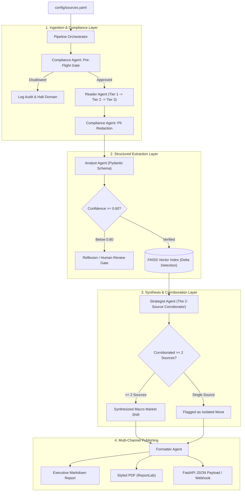

# Scrybe 🦅
### Autonomous Multi-Agent Web Intelligence & Market Synthesis System

[](https://www.python.org/downloads/)
[](https://opensource.org/licenses/MIT)
[](#architecture-overview)
[](docs/02_LEGAL_COMPLIANCE_AND_ETHICS_FRAMEWORK.md)

> **Scrybe turns raw, messy web data into decision-ready market intelligence—automatically, compliantly, and with zero hallucinations.**

---

## 🎯 Executive Overview

Modern competitive intelligence is broken. Organizations spend thousands of analyst hours manually checking competitor pricing tables and documentation, or pay $20,000–$50,000+ for legacy tools (Klue, Crayon) that still require heavy manual curation. Meanwhile, pixel-diff trackers (Visualping) fire dozens of false-alarm notifications a week, causing **up to 40% of teams to churn within 12 months due to alert fatigue**.

**Scrybe solves this with an autonomous 6-agent pipeline.**  
Instead of dumping raw HTML diffs, Scrybe autonomously crawls public pricing and feature pages, strictly verifies data against source DOM elements, cross-corroborates macro trends across $\ge 2$ independent competitors, and generates cited executive intelligence briefs.

---

## 📚 Complete Project Documentation Suite

All research, compliance frameworks, architectural blueprints, and financial models are organized in [`docs/`](docs/):

| Document | Purpose & Key Topics |
| :--- | :--- |
| 📊 [**01. Market Research & Vertical Strategy**](docs/01_MARKET_RESEARCH_AND_VERTICAL_STRATEGY.md) | Competitive intelligence market sizing ($4.1B TAM), 40% churn analysis, beachhead selection (**B2B AI Developer Tooling & APIs**), buyer personas (PMMs, Founders), and monetization model. |
| ⚖️ [**02. Legal, Compliance & Ethics Framework**](docs/02_LEGAL_COMPLIANCE_AND_ETHICS_FRAMEWORK.md) | hiQ v. LinkedIn & Meta v. Bright Data legal precedents, EU GDPR & EDPB Guidelines 03/2026, legitimate interest 3-part test, automated `robots.txt` enforcement, and regex/NER PII redactor. |
| 🏗️ [**03. System Architecture & Agent Spec**](docs/03_SYSTEM_ARCHITECTURE_AND_AGENT_SPEC.md) | Multi-agent sequential state machine, `ScrybeState` data contracts, 6 agent deep-dives, tiered scraping (`httpx` $\rightarrow$ `curl_cffi` $\rightarrow$ `Crawl4AI`), and circuit breaker recovery. |
| 📐 [**04. Data Schemas & Prompt Engineering**](docs/04_DATA_SCHEMAS_AND_PROMPT_ENGINEERING.md) | Production Pydantic models, strict `null` anti-hallucination rules, prompt templates for extraction, multi-source corroboration, self-healing selectors, and Reflexion repairs. |
| 🗺️ [**05. Implementation Blueprint & Roadmap**](docs/05_IMPLEMENTATION_BLUEPRINT_AND_ROADMAP.md) | 6-week engineering execution roadmap (Milestones M1–M6), daily task breakdown, test strategy, Docker/Postgres migration path, and acceptance criteria. |
| 💰 [**06. Feasibility & LLM Unit Economics**](docs/06_FEASIBILITY_AND_LLM_ECONOMICS.md) | Tiered hybrid LLM strategy (cheap models for extraction, frontier models for synthesis), token cost per run ($0.13), customer ROI (160% in Month 1), and >90% gross margin model. |

---

## 🏛️ Architecture Overview



---

## 🤖 The Six Autonomous Agents

| Agent | Responsibility | Core Technology |
| :--- | :--- | :--- |
| **Compliance Agent** | Enforces `robots.txt`, `ai.txt`, rate limits, and scrubs PII from all ingested raw data. | `urllib.robotparser`, Regex, spaCy NER |
| **Reader Agent** | Executes tiered crawling (`httpx` $\rightarrow$ `curl_cffi` $\rightarrow$ `Crawl4AI`), converting DOM into clean Markdown. | `httpx`, `curl_cffi`, `Crawl4AI`, `Playwright` |
| **Analyst Agent** | Normalizes token pricing and extracts structured pricing tiers with confidence scoring. | Pydantic v2, Fast LLM (Gemini Flash / Haiku) |
| **Memory & Reflexion** | Maintains rolling buffer, executes Reflexion critique loops, and detects semantic deltas via FAISS. | FAISS, `all-MiniLM-L6-v2`, Reflexion (`arXiv:2303.11366`) |
| **Strategist Agent** | Evaluates price deltas, enforces the 2-source corroboration rule, and writes sales battlecards. | Frontier LLM (Claude 3.5 Sonnet / GPT-4o) |
| **Formatter Agent** | Compiles verified intelligence into publication-quality Markdown briefs and PDF reports. | `ReportLab`, `python-docx`, `Plotly` |

---

## 🚀 Quick Start Guide

### 1. Prerequisites
- Python 3.11+ (or Python 3.12)
- [uv](https://github.com/astral-sh/uv) (recommended) or `pip`
- Docker & Docker Compose (optional for local DB/Redis)

### 2. Installation
```bash
# Clone the repository
git clone https://github.com/ChaitanyaGidwani/Scribe.git
cd Scribe

# Create virtual environment and install dependencies
uv venv
source .venv/bin/activate
uv pip install -r requirements.txt

# Configure environment variables
cp .env.example .env
# Edit .env with your LLM API keys
```

### 3. Run Verification Tests
```bash
# Run 100+ unit and integration tests (including A2A and API)
PYTHONPATH=. uv run pytest tests/ -v
```

### 4. Running Scrybe

#### A2A Multi-Agent Autonomous Pipeline (Recommended)
```bash
# Run pipeline using A2A protocol (in-process mode)
python3 cli.py run --a2a

# Run pipeline in distributed remote A2A mode
python3 cli.py run --a2a --mode remote
```

#### Launch the Modern React Intelligence Dashboard
```bash
# Start backend API (includes WebSocket streaming & static SPA hosting)
python3 cli.py api --port 8000

# Launch Vite React frontend dashboard
python3 cli.py dashboard --type react --port 3000
```
Then navigate to `http://localhost:3000` (or `http://localhost:8000` for the unified server).

### 5. Project Directory Layout
```
scrybe/
├── a2a/                # A2A Protocol v1.0 Core Layer
│   ├── models.py       # AgentCard, Task, Message, Artifact, TaskState
│   ├── server.py       # Base A2A HTTP server & JSON-RPC dispatcher
│   ├── client.py       # A2A client with SSE streaming support
│   ├── registry.py     # Local & remote Agent Card discovery
│   └── orchestrator.py # A2A-powered autonomous pipeline orchestrator
├── agents/             # The 6 autonomous agents + A2A wrappers
│   ├── compliance.py   # Pre-flight & PII redactor
│   ├── reader.py       # Tiered crawler (httpx -> curl_cffi -> Playwright)
│   ├── analyst.py      # Structured entity extraction & Reflexion
│   ├── memory.py       # Buffer, Reflexion, FAISS vector store
│   ├── strategist.py   # Multi-source corroboration (>=2 sources)
│   ├── formatter.py    # Markdown & PDF generation
│   └── a2a_wrappers.py # A2A Agent Card wrappers for all 6 agents
├── api/                # FastAPI application
│   ├── main.py         # Endpoints, SPA static mount & WebSocket hub
│   ├── routes.py       # Pricing matrix, audits, insights, reports
│   └── websocket.py    # Real-time pipeline event broadcasting
├── tools/              # Scrapers, validators, DOM grounders, parsers
├── storage/            # Pydantic models & SQLite/Postgres engine
└── memory/             # Vector store & rolling buffer
frontend/               # Modern React + Vite Dashboard
├── src/
│   ├── components/     # AgentTopology, PipelineTerminal, MatrixView, etc.
│   ├── App.jsx         # Live WebSocket listener, state sync, view tabs
│   └── index.css       # Obsidian dark theme, glassmorphism, pulse animations
docs/                   # Comprehensive research & architecture specs
tests/                  # 100+ automated test suite
```

---

## 📅 Roadmap & Milestones

- [x] **Phase 0:** Market Research, Compliance Framework & Architecture Specification.
- [x] **Milestone 1:** Ingestion Foundation & Compliance Guard (`httpx` + `robots.txt` + SQLite).
- [x] **Milestone 2:** Tiered Scraping (`curl_cffi` + `Playwright` + self-healing parser).
- [x] **Milestone 3:** Analyst Agent & Schema Extraction with confidence gating.
- [x] **Milestone 4:** Strategist Agent & Publication Engine (Multi-source + Markdown/PDF).
- [x] **Milestone 5:** Memory & Reflexion Layer (Rolling buffer + FAISS semantic deltas).
- [x] **Milestone 6:** A2A Protocol Integration, FastAPI endpoints, React dashboard & WebSocket streaming.

---

## 📜 License
This project is licensed under the MIT License — see the [LICENSE](LICENSE) file for details.