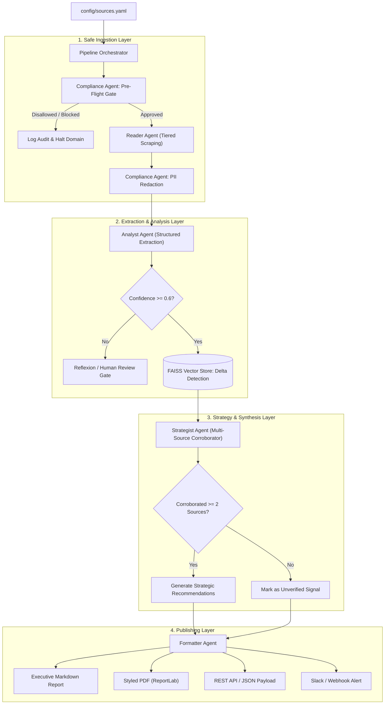

# 03. System Architecture & Agent Specification

> **Project:** Scrybe — Autonomous Multi-Agent Web Intelligence System  
> **Status:** Engineering Architecture Specification  
> **Version:** 1.0.0 (MVP Pipeline)  

---

## 1. High-Level Architecture Overview

Scrybe is engineered as an **autonomous, sequential multi-agent pipeline** with strict state transitions, defensive validation gates, and layered fault recovery.

Rather than allowing unconstrained conversational loops between agents (which lead to runaway token costs, non-deterministic latency, and hallucinated consensus), Scrybe enforces a **Deterministic Sequential State Machine** governed by a typed state object: `ScrybeState`.



---

## 2. Shared Pipeline State (`ScrybeState`)

All agents communicate by mutating and appending to a single immutable-first Pydantic state container:

```python
from pydantic import BaseModel, Field
from typing import List, Dict, Optional, Any
from datetime import datetime

class ScrybeState(BaseModel):
    # Pipeline Metadata
    pipeline_id: str
    run_timestamp: datetime = Field(default_factory=datetime.utcnow)
    target_vertical: str = "B2B_AI_DEVELOPER_PLATFORMS"
    
    # Ingestion Artifacts
    raw_scrapes: List[Dict[str, Any]] = []      # URL, raw_markdown, scrape_tier, latency
    compliance_audit: List[Dict[str, Any]] = [] # robots_ok, pii_scrubbed_count, status
    
    # Clean Extracted Entities
    extracted_records: List[Dict[str, Any]] = [] # Conforming to ProductPricingSchema
    flagged_records: List[Dict[str, Any]] = []   # Confidence < 0.6
    
    # Strategic Insights
    historical_deltas: List[Dict[str, Any]] = [] # Changes detected vs previous FAISS run
    strategic_insights: List[Dict[str, Any]] = [] # Corroborated recommendations & SWOT
    
    # Generated Outputs
    report_markdown: Optional[str] = None
    report_pdf_path: Optional[str] = None
    execution_metrics: Dict[str, Any] = {}
```

---

## 3. Deep Dive: Six Autonomous Agents

### 3.1 Agent 1: Compliance Agent (`scrybe/agents/compliance.py`)
* **Core Mandate:** Guarantee 100% legal, regulatory, and ethical compliance before and after network operations.
* **Pre-Flight Responsibilities:**
  1. Parse target domain's `robots.txt` and `ai.txt` using `urllib.robotparser`.
  2. Verify that target path is not disallowed for user-agent `Scrybe/1.0` or `*`.
  3. Extract crawl-delay directive (enforce minimum 2.5s jittered delay).
  4. Block all non-HTTPS and internal network (RFC 1918) IP addresses.
* **Post-Scrape Responsibilities:**
  1. Regex & NER-based redaction of emails, telephone numbers, and individual personal names.
  2. Emit signed audit record to `storage/db.py`.

### 3.2 Agent 2: Reader Agent (`scrybe/agents/reader.py`)
* **Core Mandate:** Fetch target web content using the lowest-cost, lowest-friction network tier, converting messy HTML into clean, token-efficient Markdown.
* **Tiered Fetching Architecture:**
  * **Tier 1 (Fast HTTP):** `httpx` async client with HTTP/2 and polite headers. Resolves 70% of static or server-rendered pricing pages (latency: <500ms).
  * **Tier 2 (TLS Impersonation):** `curl_cffi` using Chrome 120+ TLS/JA3 fingerprint. Bypasses naive CDN TLS blocks without heavy headless browser overhead (latency: <1.5s).
  * **Tier 3 (Headless Browser):** `Crawl4AI` + `playwright-stealth`. Executed only if Tier 1 and Tier 2 return empty client-side DOM containers (e.g., pure React/SPA pages).
* **DOM Pruning & Markdown Distillation:**
  * Strips `<script>`, `<style>`, `<svg>`, `<nav>`, `<footer>`, modal dialogs, and tracking pixels.
  * Preserves tabular structures (`<table>`, `<tr>`, `<td>`) and semantic headings (`<h1>` through `<h4>`).

### 3.3 Agent 3: Analyst Agent (`scrybe/agents/analyst.py`)
* **Core Mandate:** Extract structured numerical and categorical market data with deterministic zero-hallucination guarantees.
* **Extraction Guardrails:**
  * Pydantic schema validation: Prices must be numeric floats or `null`. Currencies must be ISO-4217 strings or `null`.
  * **Zero-Hallucination Directive:** Prompt explicitly forbids guessing: *"If a value is not explicitly present in the provided text, you MUST output null. Never interpolate."*
  * **Confidence Scoring Algorithm:**
    $$Confidence = 0.5 \times (DOM\_Grounding) + 0.3 \times (Schema\_Completeness) + 0.2 \times (Cross\_Field\_Sanity)$$
  * Any record with $Confidence < 0.6$ is moved to `flagged_records` for human review or Reflexion.

### 3.4 Agent 4: Memory & Reflexion Agent (`scrybe/agents/memory.py`)
* **Core Mandate:** Provide rolling execution context, failure self-correction, and semantic vector indexing to avoid redundant re-processing.
* **Component 1: Short-Term Rolling Buffer:**
  * Keeps the last 5 agent actions and error logs in memory. If an extraction step fails, the agent inspects previous failure reasons to adjust parsing strategies.
* **Component 2: Reflexion Loop (Reflexion Pattern `arXiv:2303.11366`):**
  * When an extraction fails schema validation, the agent executes a verbal self-critique:
    *"Failure: Extracted price '$0.005 / 1k' as integer. Error: Expected float per 1M tokens. Remedy: Recalculate price as 5.00 per 1M tokens."*
* **Component 3: FAISS Semantic Vector Index:**
  * Computes dense embeddings (`text-embedding-3-small` or local `all-MiniLM-L6-v2`) of previous pricing matrices.
  * Performs cosine similarity search: If today's pricing matrix has similarity $>0.995$ to last week's, mark as `UNCHANGED` and skip downstream expensive synthesis steps.

### 3.5 Agent 5: Strategist Agent (`scrybe/agents/strategist.py`)
* **Core Mandate:** Derive high-level competitive trends, pricing deltas, and actionable strategic recommendations.
* **Multi-Source Corroboration Rule (The 2-Source Constraint):**
  * Any industry-wide claim (e.g., *"LLM providers are slashing reasoning model prices"*) requires verification from $\ge 2$ independent corporate domains. Single-source movements are labeled as *Company-Specific Action*.
* **Delta Analysis Engine:**
  * Calculates exact percentage price increases/decreases across input/output token tiers.
  * Evaluates feature additions (e.g., prompt caching, fine-tuning support, batch API discounts).
* **SWOT & Battlecard Generation:**
  * Generates actionable sales enablement talking points for PMMs:
    * *Where We Win:* Competitor X lacks prompt caching and charges 40% more for context >32k.
    * *Where We Face Risk:* Competitor Y introduced zero-concurrency rate limits on Tier 2.

### 3.6 Agent 6: Formatter Agent (`scrybe/agents/formatter.py`)
* **Core Mandate:** Compile all verified intelligence into polished, human-ready decision artifacts.
* **Output Channels:**
  1. **Executive Markdown Report:** Formatted with clear headings, comparison tables, alert callouts, and academic-grade citation footnotes (`[^1]`).
  2. **Executive PDF Brief:** Generated via `ReportLab` with corporate color styling, tables, and disclaimer blocks.
  3. **Structured JSON / Webhook Payload:** Dispatched to customer endpoints, Notion, or Slack.

---

## 4. Error Handling & Circuit Breaker Architecture

```
[ HTTP Fetch Attempt ]
       │
       ├──► Status 200 OK ──────► Proceed to Compliance Post-Scrape
       │
       ├──► Status 403/429 ────► Retry Tier 2 (curl_cffi) with exponential backoff (2s, 4s, 8s)
       │                         If 3 consecutive 429s: Trip Circuit Breaker for domain (1hr cooldown)
       │
       └──► Status 404/500 ────► Log Warning, emit "SOURCE_UNAVAILABLE", fallback to FAISS cache
```

* **Domain Rate Limiter:** Per-domain Leaky Bucket enforcing maximum 1 active request per 2.5 seconds.
* **Circuit Breaker:** If a domain returns 3 consecutive HTTP 403 or 429 errors, the orchestrator trips the breaker for that domain for 60 minutes, preventing IP blacklisting.
* **Graceful Degradation:** If live scraping fails for 1 of 5 competitors, the Strategist Agent continues synthesizing the report with the remaining 4, annotating the missing competitor with historical data and a timestamped notice.
